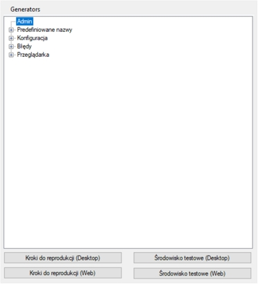
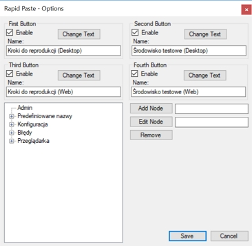

# Rapid Paste - dokumentacja
Aplikacja Rapid Paste służy do szybkiego wklejania predefiniowanych danych. Posiada cztery konfigurowalne przyciski oraz drzewko z predefiniowanymi nazwami. Po dwukliku na predefiniowanej nazwie zostaje ona skopiowana do schowka. Dodatkowo tak samo posiada generatory: męskie imie, żeńskie, nazwisko, miasto, kod pocztowy oraz adres. Po wybraniu generatora wartość zostaje skopiowana do schowka

Po uruchomieniu aplikacja działa w trayu. Aktywacja odbywa się za pomocą skrótu: ctrl+windows. 
Generatory mają przypisane swoje skróty klawiszowe takie jak: ctrl+1 lub alt+1

Aby wejść do ustawień trzeba nacisnąć prawym przyciskiem na ikonie w trayu i wybrać opcję: "Options..."

# Wymagania
Aplikacja powinna działać dla każdego systemu z rodziny Windows.

Po instalacji aplikacji w domyślnym folderze trzeba dodać uprawnienia administratora dla ikony na pulpicie dla prawidłowego działania aplikacji
